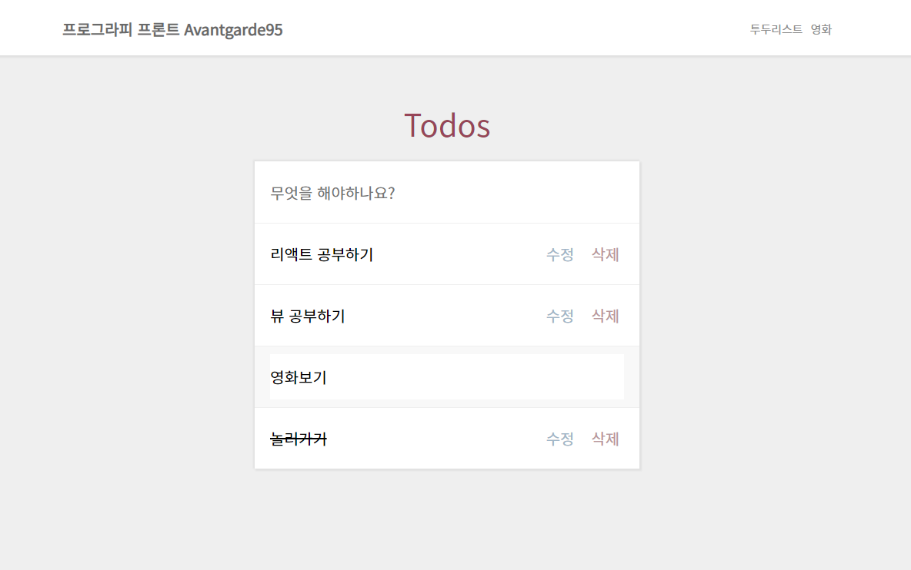
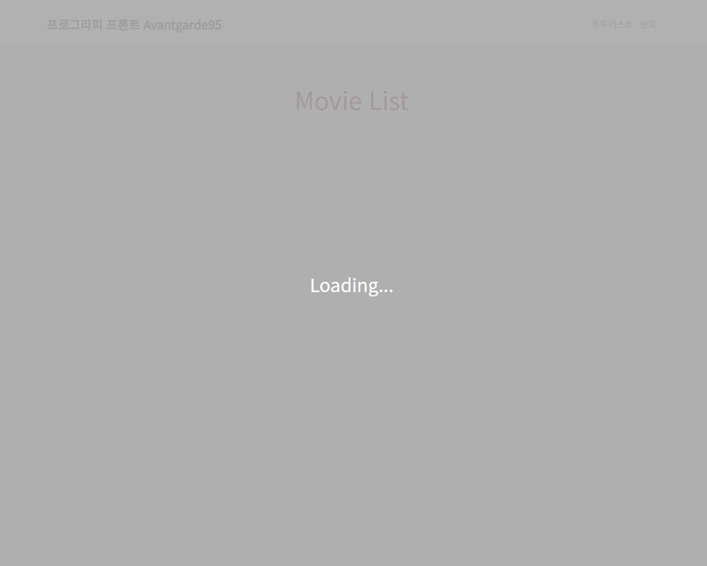
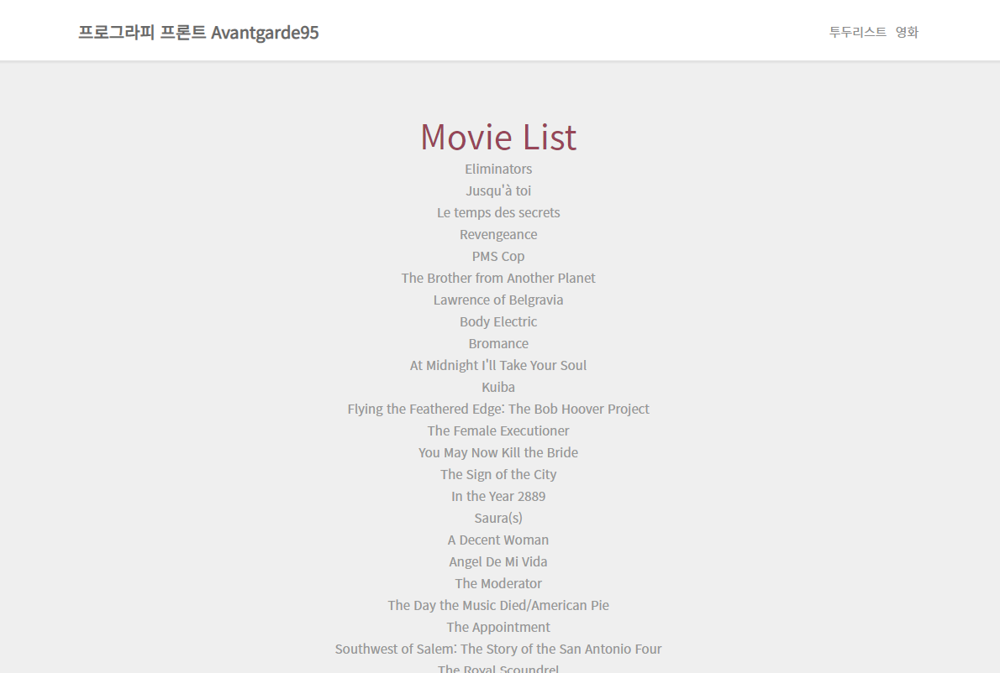
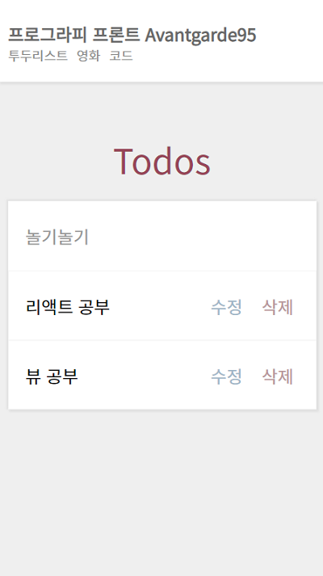

### What I did

- Project setup
- Implement whole UI
- Todo list
  - Add a task
  - Mark done / not done
  - Edit tasks
  - Delete tasks
- Movie list
  - Download movies' data
  - Loading screen (Modal: React Portal, Loading state: React Query)
  - Show movies' data

### Screenshots

On large screen

On small screen

-----

# 프로그라피 6기 React 사전과제

안녕하세요.
프로그라피 6기에 관심을 가지고 지원해 주셔서 감사합니다.

사전과제를 통해 타 분야 회원들과 원활한 협업 및 프로젝트를 진행하기 위한 기본적인 개발 실력을 확인해보고자 합니다.

사전 과제를 완벽하게 수행하지 못하시더라도 본인이 할 수 있는 만큼 성실함과 창의력을 보여주신다면 충분히 반영할 예정이니 최선을 다해 주신다면 감사하겠습니다! :)

## 무엇을 하면 되나요?

- Todo List 개발
- Movie List 개발
- 상단 바 좌측에 본인의 이름을 넣어 주세요 (i.e. 프로그라피 프론트 홍길동)
- 상단 바 우측에 각각의 페이지로 갈 수 있는 네비게이션 메뉴를 구현해주세요

## 참고사항

- CSS로 스타일링할 때 부트스트랩 테마를 사용하지 않고 구현합니다.
- react-router-dom을 사용해 SPA를 구현합니다.
- 라우터 주소는 자유롭게 설정해주세요.
- 상단 바는 페이지 이동시에도 계속 남아있어야합니다.
- Todo List 개발 시 ContextAPI, Redux, MobX 등 상태관리 라이브러리를 **필수**로 사용해주세요.

### 1. Todo List 개발

- 위의 UI를 구성해주세요
- 새로운 할일을 작성하고 **엔터키**를 입력하면 할 일이 리스트에 추가됩니다.
- **수정** 버튼을 클릭하면 해당 리스트에 Input이 생성되고 바로 수정할 수 있습니다.
  - 수정 또한 **엔터키**를 입력하면 수정사항이 반영됩니다.
- **삭제** 버튼을 클릭하면 리스트에서 항목이 삭제되도록 합니다.
- 리스트 클릭 시 해당 항목에 **취소선이 표시**되면서 완료된 상태로 변경됩니다.
  - 완료된 리스트를 클릭했을때는 **취소선이 사라지고** 미완료 상태로 변경합니다.

### 2. Movie List 개발

> API_URL: https://yts.mx/api/v2/list_movies.json?limit=50

- 위의 UI를 구성해주세요
- 첨부한 **API_URL** 요청을 통해서 영화 제목(title)을 리스팅 해주세요.
- Promise를 이용해서 API reponse가 오기전에 로딩 화면을 구현해주세요.
  - async/await 사용 가능

## 과제 선정의 이유

- 기본적인 CRUD 구현 가능 여부를 확인하기 위함
- 비동기로 실행되는 자바스크립트에서 서버 데이터를 받아서 제어할 수 있는지 확인하기 위함
- 제시된 디자인을가지고 CSS 스타일링을 할 수 있는지 확인하기 위함
- 상태관리 라이브러리를 한가지 이상 다룰 수 있는지 확인하기 위함

## 제출 방법

- 서류 제출 시 작성한 자신의 github에 "prography*6th_react*이름" 의 저장소를 생성하여 업로드 해주세요

## 마감 기한

- 마감 기한은 2020년 03월 05일 23:59까지 이며, 기한 내 Commit만 인정합니다.

## 문의사항

- 사전과제를 진행하며 궁금한 점은 아래의 오픈 채팅방을 통해서 문의해주시기 바랍니다.
  > https://open.kakao.com/o/sDBDUcZb

## 예시

- 첨부한 example.mp4 파일로 과제 예시를 확인해볼 수 있습니다.
